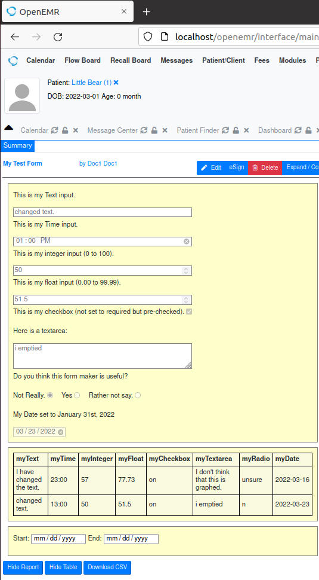

# OpenEMR-form-builder
This python script makes forms for OpenEMR medical record system.

## INPUT - The program takes an input file in form of json.
(see example of input.json in folder)

## PROCESS - Run formBuilder.py
(must have python3.x installed)

## OUTPUT - You get a folder with contents. 
 - Take that folder and place it in the openemr/interface/forms folder.
 - Inspect it to make sure you like what it produced, like table.sql for example.
 - You will still need to know how to register your form, enable it etc. (see https://www.open-emr.org/wiki/index.php/HOWTO_Register_OpenEMR_Contributed_Forms)

## Enjoy your new form which has an attached table with start and end filters.

 - At this point you may need to adjust styling and layout manually.

Here is an example:



### And here was the input.json folder:

```
{
    "folderName": "testForm",
    "formName": "My Test Form",
    "width": "650px",
    "orderByField": "myDate",
    "order": "ASC",
    "inputs": [{
            "type": "text",
            "properties": {
                "name": "myText",
                "label": "This is my Text input.",
                "value": "Some prefilled text here is possible.",
                "required": "required",
                "showInTable": "true"
            }
        },
        {
            "type": "time",
            "properties": {
                "name": "myTime",
                "label": "This is my Time input.",
                "value": "13:00",
                "required": "required",
                "showInTable": "true"
            }
        },
        {
            "type": "integer",
            "properties": {
                "name": "myInteger",
                "label": "This is my integer input (0 to 100).",
                "value": "50",
                "min": "0",
                "max": "100",
                "required": "required",
                "showInTable": "true"
            }
        },
        {
            "type": "float",
            "properties": {
                "name": "myFloat",
                "label": "This is my float input (0.00 to 99.99).",
                "value": "51.5",
                "min": "0.00",
                "max": "99.99",
                "step": "0.01",
                "required": "required",
                "showInTable": "true"
            }
        },
        {
            "type": "checkbox",
            "properties": {
                "name": "myCheckbox",
                "label": "This is my checkbox (not set to required but pre-checked).",
                "value": "on",
                "checked": "checked",
                "required": "",
                "showInTable": "true"
            }
        },
        {
            "type": "textarea",
            "properties": {
                "name": "myTextarea",
                "label": "Here is a textarea:",
                "value": "You can put prefilled text here.",
                "required": "",
                "showInTable": "true"
            }
        },
        {
            "type": "radio",
            "properties": {
                "name": "myRadio",
                "label": "Do you think this form maker is useful?",
                "required": "required",
                "showInTable": "true",
                "buttons": [{
                        "value": "n",
                        "label": "Not Really."
                    },
                    {
                        "value": "y",
                        "label": "Yes"
                    },
                    {
                        "value": "unsure",
                        "label": "Rather not say."
                    }
                ]
            }
        },
        {
            "type": "date",
            "properties": {
                "name": "myDate",
                "label": "My Date set to January 31st, 2022",
                "value": "2022-01-31",
                "required": "required"
            }
        }
    ]
}

```

### Also in this repository, there is a gui-based program (text2string2.py).  I wrote it in order to copy code to strings for writing to text files.  It requires tkinter in Python3.  I leave it in this repository because it helps me work on this repository and is nice to have on hand.  It is not necessary for building forms.


## A special thanks to Otilia Kocsis, PhD who kindly agreed to guide me on this project.  This was the basis for my internship in Software Engineering at West Virginia University Community College, located in Wheeling WV USA.

### Interestingly, it uses multiple languages and formats including Python, JavaScript, PHP, HTML, CSS, JSON, SQL, and CSV.


http://www.boktech.eu/otiliakocsis/

https://www.wvncc.edu

https://www.wvncc.edu/programs/software-engineering-a.a.s/480